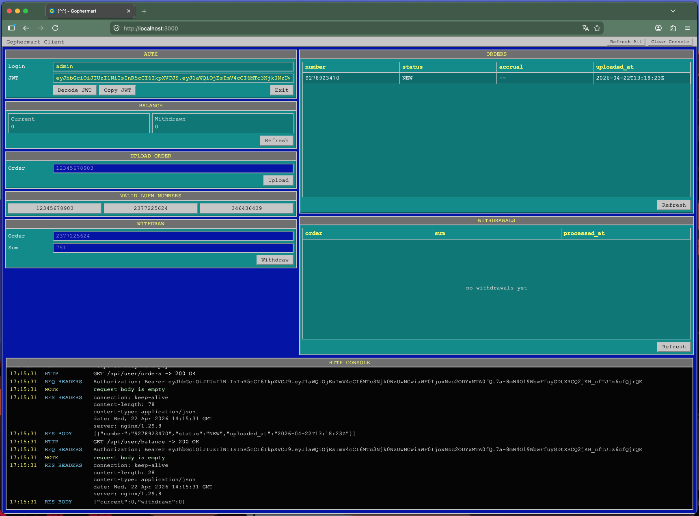

# (^.^)~ Gophermart

```text
  ________              .__                                        __   
 /  _____/  ____ ______ |  |__   ___________  _____ _____ ________/  |_ 
/   \  ___ /  _ \\____ \|  |  \_/ __ \_  __ \/     \\__  \\_  __ \   __\
\    \_\  (  <_> )  |_> >   Y  \  ___/|  | \/  Y Y  \/ __ \|  | \/|  |
 \______  /\____/|   __/|___|  /\___  >__|  |__|_|  (____  /__|   |__|
        \/       |__|        \/     \/            \/     \/
```

Шаблон репозитория для индивидуального первого дипломного проекта курса «Go-разработчик»:
[go-musthave-diploma-tpl](https://github.com/yandex-praktikum/go-musthave-diploma-tpl)

## Накопительная система лояльности «Гофермарт»

Владельцы одного интернет-магазина хотят ввести скидки для постоянных покупателей и систему накопления баллов, которыми можно расплачиваться. Соответственно, нужны разработчики. Возьмёте заказ?

Техническое задание - см. [SPECIFICATION.md](SPECIFICATION.md)

## Локальный запуск

Локально проект можно запускать как в backend-only режиме, так и в полном режиме через Docker Compose: PostgreSQL + Gophermart API + accrual + web-клиент.

## Локальный запуск через Docker Compose

Поднять приложение и PostgreSQL, accrual и web-клиент:

```bash
make run-dev
```

После старта будут доступны:

- Backend API: `http://localhost:8080`
- Accrual API: `http://localhost:8081`
- PostgreSQL: `localhost:5432`
- Frontend Client: `http://localhost:3000`

<p align="center">
  
</p>

Остановить окружение:

```bash
make run-dev-down
```

Посмотреть логи:

```bash
make run-dev-logs
```

> В `docker-compose.yml` backend запускается с `RUN_ADDRESS=:8080`, чтобы API было доступно с хоста. База данных сохраняется в Docker volume.
> `accrual` поднимается отдельным контейнером и доступен для `gophermart` внутри compose-сети по адресу `http://accrual:8080`, а с хоста - по `http://localhost:8081`.
> Web-клиент поднимается отдельным контейнером и проксирует запросы в backend через `GOPHERMART_UPSTREAM=http://gophermart:8080`.

## Локальный запуск без Docker Compose

Этот сценарий поднимает backend и PostgreSQL без контейнеров `client` и `accrual`.

Для полного локального окружения с web-клиентом и accrual использовать запуск через Docker Compose (описан выше).

### 1. Поднять PostgreSQL

```bash
make postgres-up
```

Если контейнер уже существует, можно использовать:

```bash
make postgres-start
```

### 2. Запустить приложение

```bash
make run
```

Подключиться к базе:

```bash
make postgres-connect
```

Остановить или удалить контейнер с базой:

```bash
make postgres-stop
make postgres-rm
```

## Полный локальный сценарий

Для быстрого ручного прогона удобно использовать Docker Compose:

1. Отрыть клиент: `http://localhost:3000`
2. Зарегистрировать пользователя и выполнить вход
3. Загрузить номер заказа
4. Проверить баланс
5. Выполнить списание баллов
6. Проверить историю списаний

## Gophermart: примеры curl-запросов

> После успешного `register` или `login` взять JWT из заголовка `Authorization` ответа и подставить его вместо `<jwt-token>`.

### Регистрация

```bash
curl -i -X POST http://localhost:8080/api/user/register \
  -H "Content-Type: application/json" \
  -d '{"login":"admin","password":"secret"}'
```

### Логин

```bash
curl -i -X POST http://localhost:8080/api/user/login \
  -H "Content-Type: application/json" \
  -d '{"login":"admin","password":"secret"}'
```

### Загрузка номера заказа

```bash
curl -i -X POST http://localhost:8080/api/user/orders \
  -H "Authorization: Bearer <jwt-token>" \
  -H "Content-Type: text/plain" \
  -d '12345678903'
```

### Получение списка загруженных заказов

```bash
curl -i http://localhost:8080/api/user/orders \
  -H "Authorization: Bearer <jwt-token>"
```

### Получение баланса

```bash
curl -i http://localhost:8080/api/user/balance \
  -H "Authorization: Bearer <jwt-token>"
```

### Списание баллов

```bash
curl -i -X POST http://localhost:8080/api/user/balance/withdraw \
  -H "Content-Type: application/json" \
  -H "Authorization: Bearer <jwt-token>" \
  -d '{
    "order": "2377225624",
    "sum": 5.11
  }'
```

### Получение истории списаний

```bash
curl -i http://localhost:8080/api/user/withdrawals \
  -H "Authorization: Bearer <jwt-token>"
```

---

[](https://sonarcloud.io/summary/new_code?id=xhrobj_gophermart)
